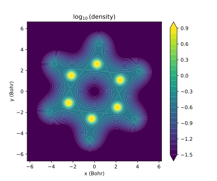

# visualize_charge_density

The script `plotdensity.py` can make 3D and 2D plots of the electron density from a closed-shell SCF calculation. You must supply:

1. a `.json` file describing the geometry of the molecule and the basis set used
2. A `.npy` file containing a density matrix

The script `psi4getdensity.py` can generate these for you if you have Psi4.

### Dependencies

`plotdensity.py` has the following dependencies:
* NumPy
* Numba
* SciPy
* matplotlib, if you want to make 2D contour plots
* PyVista, if you want to make interactive 3D plots

If you have `pipenv`, just type `pipenv install` to obtain these.

### Example usage
`./plotdensity.py exampledata/benzene.json exampledata/benzene.npy`
