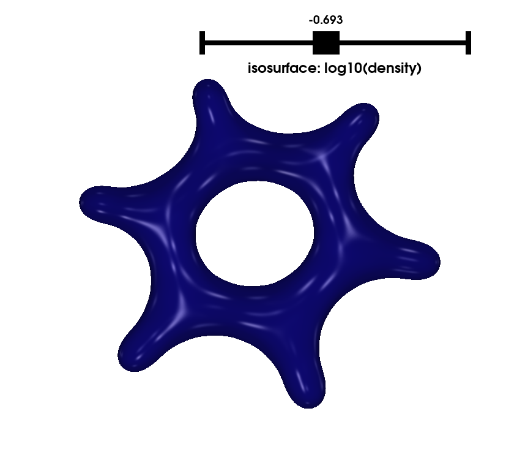

# visualize_charge_density

The script `plotdensity.py` can make 3D and 2D plots of the electron density from a closed-shell SCF calculation. You must supply:

1. a `.json` file describing the geometry of the molecule and the basis set used
2. A `.npy` file containing a density matrix

The script `psi4getdensity.py` can generate these for you if you have Psi4. A few examples are provided in the exampledata folder. Unless otherwise specified, these examples use the cc-pVDZ basis set with cartesian GTOs.

### Dependencies

`plotdensity.py` has the following dependencies:
* NumPy
* Numba
* SciPy
* matplotlib, if you want to make 2D contour plots
* PyVista, if you want to make interactive 3D plots

If you have `pipenv`, just type `pipenv install` to obtain these.

### Getting started
For usage information, run `./plotdensity.py --help`.

By default, the script will produce 2D contour plots of the density on the x-y plane:

`./plotdensity.py exampledata/benzene.json exampledata/benzene.npy`

Output:
```
Number of atoms:                           12
Number of shells:                          54
Number of basis functions:                120
Number of primitives:                     288
Primitive pairs:                        41328
Unique primitive pair centers:           2490
```


Try out 3D interactive mode with the `-i` flag:

`./plotdensity.py exampledata/benzene.json exampledata/benzene.npy -i`
